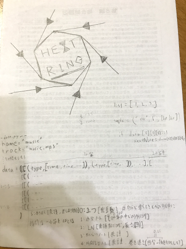
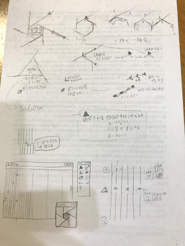
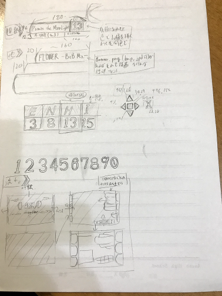
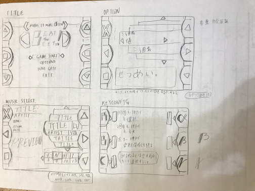
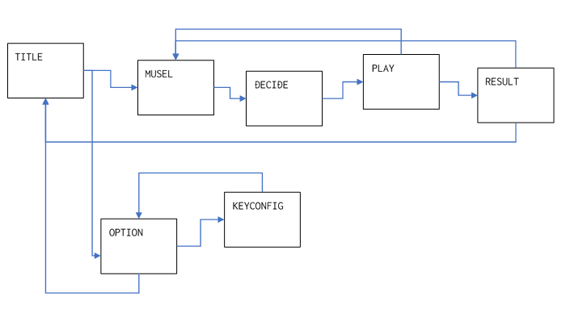

# プロジェクト管理ってなんじゃらほい
* EwdErna

## 誰得？
さぁ……(放任)

## TL,DR
俺がよくゲーム製作などでやることをまとめて書き出してみる。  
正直これやってうまくできたとかそんなこともない ~~し、そもそも最近やり始めたことだからあんま実効性が云々とかわからん~~ 。

## 目次
1. [下準備](#sitajunnbi)
1. [シーンの用意](#scene)
1. [データの用意](#data)
1. [やることの用意](#todo)
1. [メソッドの用意](#method)
1. [コーディング](#coding)

 
  

## 下準備 
作りたいものを決める。  
当たり前、とか言わない。これがないとモチベが保てないし、この後の手順にも響く。

ビジュアルを決めたり、仕様を決めたり。これだけでもうゲームが動いているところを想像できるレベルまで詳細に書き連ねる。  
 

## シーンの用意 
[sp6章 メニュー画面の作り方(C++編) - 新・C言語 ～ゲームプログラミングの館～ [DXライブラリ]](<https://dixq.net/g/sp_06.html>)  
自分のゲーム設計はだいぶこのサイトに影響されてる。  
いまだにスタイル確立できてなかったらここからパクろう。

各種シーンを決め、とりあえず名前を付ける。  
おぼろげにシーンごとの役割を考えてないと決められない。詳細までは後回しでいいがある程度の動きを決めておく。  

## データの用意 
~~この辺からまともに運用できてない理想論なのでクッソ雑。うまくいく保証もない~~

各シーンごとに必要なデータを列挙していく。  
この時点である程度のクラス分けが決定するのでそのままクラスの雛形を書いてしまうのもいい。知らんけど～。  

## やることの用意 
ここまでで書き連ねたことをもとにして、各クラスがするべきこと/してはいけないことなどを決めていく。  
シーンの機能だったりデータクラスのインターフェイスだったり。  

HEXTRINGでは、シーンの遷移先や遷移条件、表示するものとかそんなんを列挙した。

## メソッドの用意
前項で書き出したことをもとに、各クラスが公開するべきメソッドを宣言する。定義は後まわし。  
あとプライベートメソッドも後回し。そんなものはインターフェイスに必要ない。

中身をある程度に詰めてしばらく寝かせておく。

## コーディング
最低限必要なものである"ガワ"の定義が終わったところでコーディングに入る。  
メソッドの機能を少しずつ細分化しながら、できうる限りの構造化を心掛けながら可読性を高めて保守性をうんぬんかんぬん。  
やり方は個々人に任せるけど、個人的には
* そのメソッドがすることを10行程度で説明する。1行1工程になるように。
* 説明の各行をさらに10行程度で説明する。
* 必要ならどこまでも繰り返す。最終的に公開メソッドと標準ライブラリ関数、四則演算の組み合わせにまで落とし込む。

みたいな手順で。  
当然この中でほかのところでも使う機能が出てくればプライベートメソッドとして実装すりゃいい。

## あとがき？
とりあえず現行の「プログラムの書き方」はこんな感じ。
[シーンの用意](#scene)とかまんま「ゲーム専用」って感じだけど許してほしい。

おわっていい？
